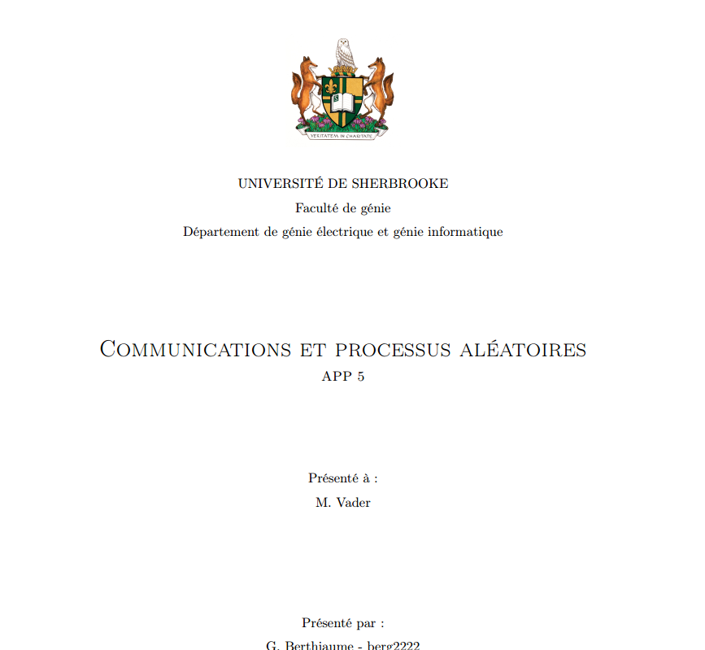

<p align="center"></p>


# LaTeX Template - UdeS

A latex template for undergraduate students, with respect to the standard establish by the engineering department of Université de Sherbrooke (UdeS).

As the Université de Sherbrooke is a francophone establishment, the following README.md will be written in french. 


## Apperçu 

Ce gabarit (template) définit une classe LaTeX offrant une liste de fonctionnalité utile pour faciliter et accélérer la création de rapport. 

Par exemple, pour créer une page titre, il suffit d'entrer:

```latex
% nous somme dans main.tex

\faculte{Génie}
\departement{Génie électrique et Génie informatique}
\app{5}{Communications et Processus aléatoires}
\professeur{M. Vader}
\etudiants{G. Berthiaume - berg2222}
\dateRemise{12 Juillet 2017}

\fairePageTitre{LOGO}
```

La compilation en pdf de cette commande générera ceci: 

 

> Pour un aperçu complet du rapport rendu en pdf, veuilez vous référer au dossier [bin](https://github.com/g-berthiaume/latex_template_udes/tree/master/bin/).


Les fonctionnalités incluent entre autres:

- Meilleur support pour les maths
- Ajouter des "code snippet" dans le rapport
- Table des matières 
- Table des figures

## Débuter 

### En ligne

Ce gabarit a été construit pour fonctionner sans problème sur les éditeurs LaTeX en ligne [sharelatex](https://www.sharelatex.com/) et [overleaf](https://www.overleaf.com/).

Pour utiliser le gabarit, téléchargez/clonez ce repo github pour ensuite le téléverser sur votre éditeur en ligne de choix. 
L'intégration et la compilation devraient se faire sans erreur.

### Locale

Pour utiliser le gabarit sur votre ordinateur, il vous faudra un éditeur de texte et une distribution LaTeX. 

Nous suggérons la distribution [Miktex](https://miktex.org/).

L'installation de packages sera aussi nécessaire. Veuillez vous référer à la section suivante de ce document.

Une fois l'installation terminé, téléchargez/clonez ce repo github et vous pourrez utiliser le gabarit.

## Prérequis 

Pour utiliser cette classe, les packages suivants sont nécessaires:

- amsmath – AMS mathematical facilities for LaTeX
- amssymb - CTAN package not found
- babel – Multilingual support for Plain TeX or LaTeX
- bm – Access bold symbols in maths mode
- etoolbox – e-TeX tools for LaTeX
- fancyhdr – Extensive control of page headers and footers in LaTeX2ε
- float – Improved interface for floating objects
- fontenc – Standard package for selecting font encodings
- geometry – Flexible and complete interface to document dimensions
- graphicx – Enhanced support for graphics
- hyperref – Extensive support for hypertext in LaTeX
- inputenc – Accept different input encodings
- lastpage – Reference last page for Page N of M type footers
- lipsum – Easy access to the Lorem Ipsum dummy text
- minted – Highlighted source code for LaTeX
- natbib – Flexible bibliography support
- pgffor - CTAN package not found
- xcolor – Driver-independent color extensions for LaTeX and pdfLaTeX
- xfrac – Split-level fractions in LaTeX2ε*
- xifthen – Extended conditional commands
- xparse – A generic document command parser


## Pourquoi LaTeX (et pas msword) ?

Je pense que l'excellent article de sharelatex a une fa^con élégante de répondre à la question :

> LaTeX is used all over the world for scientific documents, books, as well as many other forms of publishing. Not only can it create beautiful typesetted documents, but it allows users to very quickly tackle the more complicated parts of typesetting, such as inputting mathematics, creating tables of contents, referencing and creating bibliographies, and having a consistent layout across all sections. Due to the huge number of open source packages available (more on this later), the possibilities with LaTeX are endless. These packages allow users to do even more with LaTeX, such as add footnotes, draw schematics, create tables etc.

> One of the most important reasons people use LaTeX is that it separates the content of the document from the style. This means that once you have written the content of your document, we can change its appearance with ease. Similarly, you can create one style of document which can be used to standardise the appearance of many different documents. This allows scientific journals to create templates for submissions. These templates have a pre-made layout meaning that only the content needs to be added. In fact there are hundreds of templates available for everything from CVs to slideshows.

J'ajouterais que l'utilisation de `git` et l'habilité de `parser` des documents LaTeX donne beaucoup de flexibilité au créateur.
Il est à noter que MsWord reste un outil puissant. Ce graphique résume bien comment choisir quel outil utiliser pour son projet: 


## License

Ce projet est sous la liscence MIT - voir LICENSE.md pour les détailes

This project is licensed under the MIT License - see the LICENSE.md file for details
